<br />
<br />

# MLflow Usage Documentation for DevOps

This documentation provides a comprehensive guide on how to utilize MLflow for managing the machine learning lifecycle, including experimentation, model tracking, and deployment. The focus here is on executing an MLflow-enabled Python script within a Kubernetes (K8s) pod. The MLflow server is accessible within the pods through a dedicated K8s service named `mlflow-service` located in the `mlops-dev` namespace.

## Table of Contents
<style scoped>
table {
  font-size: 9px;
}
</style>

| Syntax                                                                            | Description                                                                               |
| :-------------------------------------------------------------------------------- | :---------------------------------------------------------------------------------------- |
| ML flow Usage                                                                     |                                                                                           |
| [Prerequisites](#prerequisites)                                                   | What is needed to use ML flow in python                                                   |
| [Installation](#installation)                                                     | Methods for installing mlflow, both manually and using ArgoCD                             |
| [Use](#use)                                                                       | How to use mlflow after installation                                                      |
| [Maintainance](#maintainance)                                                     | Backup strategies and maintenance practices for                                           |
| [Looking Ahead](#looking-ahead)                                                   | Future plans and enhancements for the backup processes                                    |
| [Architecture Vision and services used](#architecture-Vision-and-services-used)   | Information on the infrastructure and interaction with other services                     |
| [Conclusion](#conclusion)                                                         | Summary of the MLflow usage documentation                                                 |

<div style="page-break-after: always"></div>

## Prerequisites

Before proceeding, ensure you have performed the following steps:

- Ensure you have access to the server/cluster (access to master node(s))
- Ensure kubectl is installed in the master node(s) [link](https://kubernetes.io/docs/tasks/tools/)
- Ensure Helm is installed in the master node(s)
- Ensure you have StorageClasses available or already configured inside of Kubernetes cluster
- Necessary permissions to execute scripts within a Kubernetes pod.

<div style="page-break-after: always"></div>

## Installation

Installation is being divided into two methods: manual and automatic (using ArgoCD). The manual method involves directly configuring and deploying mlflow using Helm commands. On the other hand, the automatic method leverages ArgoCD, a declarative GitOps continuous delivery tool, to manage the deployment of mlflow. This approach streamlines the installation process by automating the deployment and management of the necessary resources through Git repositories, ensuring consistency and ease of updates. Currently, the deployment of mlflow is being handled via ArgoCD, which facilitates seamless and efficient management of the deployment, providing an automated and reliable way to maintain the mlflow infrastructure.

### Manual Installation

#### Installing through Helm chart

To install mlflow on-premises, follow these detailed steps to ensure a successful deployment using Helm:

1. **Add the mlflow Helm Repository**:
   Begin by downloading this repocontaining the Helm charts.

2. **Configure Helm Values**:
    Configure the Helm values for various components including `namespace`, `image`, `Ingress`, `replicaCount`, and `storage`. Below is an example configuration used for Dev environment:

    ```yaml
    namespace: 
    replicaCount: 3
    debug: false

    podAnnotations: {}

    autoscaling:
      enabled: false
      minReplicas: 1
      maxReplicas: 100
      targetCPUUtilizationPercentage: 80


    image:
      repository: <your_registry>
      tag: v2.11.3
      pullPolicy: IfNotPresent

    storage:
      enabled: true
      storageClass: <YOUR_STORAGE_CLASS>

    resources: {}

    persistentVolumes:
      datasets:
        name: datasets-pv
        nfsPath: path_to_save_datasets
        nfsServer: your_server_url
        size: <AMOUNT_OF_STORAGE_FOR_DATASETS>
      models:
        name: models-pv
        nfsPath: path_to_save_models
        nfsServer: your_server_url
        size: <AMOUNT_OF_STORAGE_FOR_MODELS>
      mlflow:
        name: mlflow-pv
        nfsPath: path_to_save_mlflow_components
        nfsServer: your_server_url
        size: <AMOUNT_OF_STORAGE_FOR_MLFLOW_DB>

    ```


3. **Deploy mlflow**:
    Use Helm to install mlflow with the configured settings. Ensure you set the deployment target to local, enable the proxy, and specify the appropriate service type and host.

    ```sh

    helm install my-mlflow . /folder_with_mlflow_templates --namespace mlops-dev
    ```

4. **Verify installation**:
    In another terminal, run the following command to check the status of your pods:

    ```sh
    kubectl get pods
    ```

    you should be able to see a similar output like this:

    ```
    NAME                      READY      STATUS      RESTARTS        AGE
    mlflow-5ddf55689f-8nfwb     1/1     Running             0        19d
    mlflow-5ddf55689f-j97df     1/1     Running             0        19d
    mlflow-5ddf55689f-mlszn     1/1     Running             0        19d

    ```


### Deploying mlflow through ArgoCD

#### Overview

mlflow is deployed in our MLOps pipeline through ArgoCD, which automates the synchronization and management of Kubernetes resources from a git repository. This documentation covers the process of deploying mlflow using ArgoCD.

#### Repository Structure

The current structure of the repositoryis as follows:

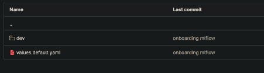

- **charts:** Contains Helm chart metadata.
- **templates:** Helm templates for Kubernetes objects (PV, PVCs, Ingress, Service and Deployment).
- **values.yaml:** The main configuration file where you can define values for different environments (dev, prod, etc.).

The repository is designed to accommodate additional folders for different environments (e.g., **prod, QA**). When you commit changes to the master branch or any other tracked branch, ArgoCD detects the changes and automatically deploys them to the specified environment.


#### ArgoCD Template and Values

The ArgoCD application set template and values are defined in this [this repo](https://github.com/oliver2401/mlops):

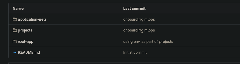

This repository contains the YAML files for the AppProject and ApplicationSet resources ( within the folders `projects/templates/appproj.mlops.yaml` and `applications-sets/templates/appset.mlops.yaml` respectively), which define the deployment configurations for ArgoCD.

#### Deploying mlflow
##### AppProject

The AppProject defines the boundaries for what resources and destinations are permissible for the Application.

```yaml

apiVersion: argoproj.io/v1alpha1
kind: ApplicationSet
metadata:
  name: "mlops-{{ .Values.environment }}"
  namespace: argocd
spec:
  generators:
  - git:
      repoURL: 'https://github.com/oliver2401/mlops.git'
      revision: 'main'
      files:
        - path: "apps/*/{{ .Values.environment }}/values.yaml"
  template:
    metadata:
      name: '{{ "{{path[1]}}" }}'
    spec:
      project: "mlops-{{ .Values.environment }}"
      source:
        repoURL: 'https://github.com/oliver2401/mlops.git'
        targetrevision: 'main'
        path: '{{ "{{path}}" }}'
        helm:
          valueFiles:
          - '../values.default.yaml'
          - 'values.yaml'
      destination:
        name: "in-cluster"
        namespace: "mlops-{{ .Values.environment }}"
      syncPolicy:
        automated:
          prune: true
          selfHeal: true
```
This resource scopes the deployment to a particular environment, specified by {{ .Values.env }}.


Within application-sets go to `/templates/appset.mlops.yaml` to specify the MLFlow version. Within the path `application-sets/templates/appset.mlops.yaml` you will be able to specify the specific revision of the MLFlow version that you want to deploy. The specific revision of MLFlow can be modified in the previously mentioned “ml-ops”. In this example all the configuration specifications to deploy MLflow in a dev environment are present within the “dev” folder, such as values specific to dev. In the future you can create additional folders apart from dev (such as prod and QA) and specify within those folders values for those environments. This way whenever you make a commit, and it is merged to the master (or any other branch you are tracking) Argo will detect automatically the changes and deploy automatically the changes in the environment  specified  in the folder you integrated your changes.

within the "application-sets/templates/appset.mlops.yaml" define an `ApplicationSet` in ArgoCD to manage the lifecycle of your MLFlow application across different environments. Use the following template snippet to create your `ApplicationSet`:

``` yaml

apiVersion: argoproj.io/v1alpha1
kind: ApplicationSet
metadata:
  name: "mlops-{{ .Values.environment }}"
  namespace: argocd
spec:
  generators:
  - git:
      repoURL: 'https://github.com/oliver2401/mlops.git'
      revision: 'main'
      files:
        - path: "apps/*/{{ .Values.environment }}/values.yaml"
  template:
    metadata:
      name: '{{ "{{path[1]}}" }}'
    spec:
      project: "mlops-{{ .Values.environment }}"
      source:
        repoURL: 'https://github.com/oliver2401/mlops.git'
        targetrevision: 'main'
        path: '{{ "{{path}}" }}'
        helm:
          valueFiles:
          - '../values.default.yaml'
          - 'values.yaml'
      destination:
        name: "in-cluster"
        namespace: "mlops-{{ .Values.environment }}"
      syncPolicy:
        automated:
          prune: true
          selfHeal: true

```

The ApplicationSet uses a Git generator to monitor a repository and create Applications based on changes to the specified files.

#### Environment Specific Configuration

##### Modifying Values for New Environments

To deploy mlflow in a new environment, you can simply modify the values in the `values.yaml` file corresponding to that environment. This allows for a flexible and scalable deployment process.

Create and manage environment-specific configurations (e.g., dev, prod, QA) to facilitate automated deployments via ArgoCD upon commits to tracked branches.

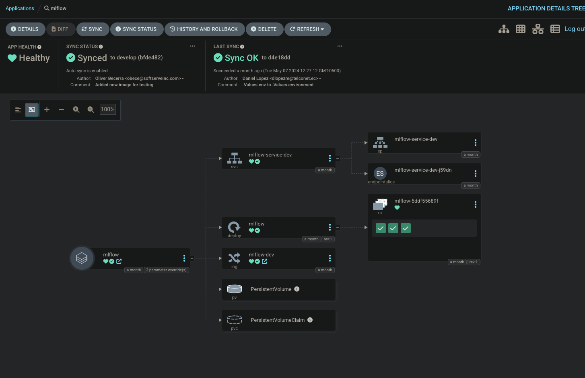

Deploying and using MLFlow on Kubernetes can involve several typical challenges, especially given the complexity of both technologies. Below are some common errors you might encounter and solutions to address them:

1. Image Pull Errors
Error: Kubernetes is unable to pull the Docker image of MLFlow from the registry due to permissions issues or because the image does not exist.
Solution:
•	Ensure that the Docker image is correctly tagged and exists in the registry.
•	Verify that Kubernetes has the correct credentials to access the Docker registry.
•	Check the image pull policy in your Kubernetes deployment configuration. If set to IfNotPresent, the local image will be used; if not found, it attempts to pull it from the registry.

2. Insufficient Resource Quotas
Error: MLFlow deployments may fail to start if the cluster does not have enough resources (CPU, memory).
Solution:
•	Review the resource requests and limits specified in the deployment configurations.
•	Adjust the resource quotas in the Kubernetes namespace or scale the cluster resources accordingly.

3. Persistent Volume Claim (PVC) Issues
Error: The PVCs required for MLFlow do not bind, or the expected storage class is not available.
Solution:
•	Ensure that the storage class specified in the PVC configuration exists in your Kubernetes cluster.
•	Check that the persistent volumes (PVs) have sufficient capacity and are in the correct state (available/not bound).
•	Review access modes of the PVCs to ensure they match the capabilities of the storage system.

4. Networking Issues
Error: MLFlow server is running but not accessible from outside the Kubernetes cluster.
Solution:
•	Configure an Ingress or a LoadBalancer service depending on your cluster setup to expose the MLFlow service.
•	Ensure the correct port is exposed and the service is pointing to the right port on the MLFlow pods.
•	Check network policies and firewall rules that may be preventing access to the service.

5. Configuration Errors
Error: MLFlow misconfigurations, such as incorrect database URIs or improper setup of environment variables.
Solution:
•	Double-check all configurations for typos or incorrect values, especially in your values.yaml file if deploying via Helm.
•	Validate the environment variables and secrets used by MLFlow for connecting to backend services like databases and artifact stores.

6. Version Compatibility Issues
Error: Compatibility issues between MLFlow and the underlying Python packages or Kubernetes versions.
Solution:
•	Ensure that the version of MLFlow you are deploying is compatible with the Python packages it depends upon.
•	Use a virtual environment to isolate and manage Python dependencies.
•	Keep your Kubernetes cluster and client tools (kubectl, Helm) up-to-date.

7. MLServer Not Starting
Error: MLServer fails to start within the MLFlow deployment due to configuration errors or dependency problems.
Solution:
•	Check the MLServer logs for any explicit errors regarding configuration or missing dependencies.
•	Ensure that the MLServer version is compatible with your MLFlow setup.
•	Review the command and arguments in the MLFlow deployment to ensure they are correctly formatted.

Addressing these typical errors involves a thorough understanding of both MLFlow's and Kubernetes' operational environments. Regular monitoring, logging, and alerting can help detect and mitigate these issues efficiently.


##### Verify Deployment using ArgoCD GUI


Once you have made changes to the mlflow service and its `values.yaml` file, you will need to ensure that these changes are correctly applied and that the service is functioning as expected. To do this, navigate to the ArgoCD interface at [pending-dnd-url](https://<pending_dns>). 

In the ArgoCD dashboard, search for the `mlflow` application as shown in the following image: 

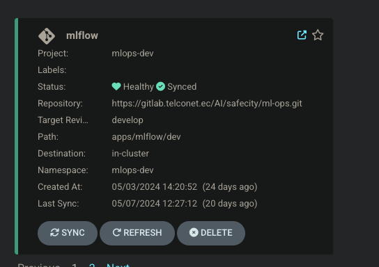

Verify that the application is correctly synced and has a healthy status. This step is crucial to confirm that the updates have been successfully deployed and that the mlflow service is operating without issues. Monitoring the sync status and health in ArgoCD helps maintain the stability and reliability of your mlflow deployment. An example of the healthy status of the app might look like the following:


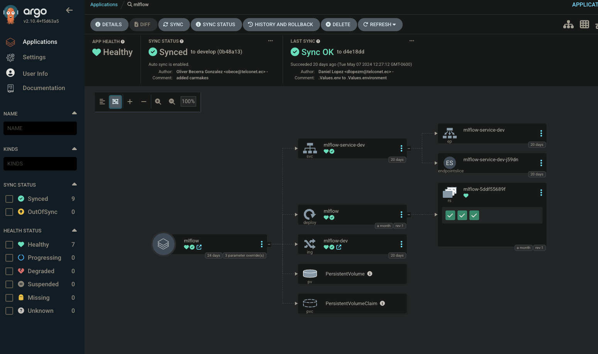


#### Accessing mlflow from Outside the Cluster

To access mlflow from outside the Kubernetes cluster (e.g., via a web browser), you need to enable and configure a Kubernetes ingress. This can be done by modifying the `values.yaml` file with the following parameters:

```yaml
ingress:
  enabled: true
  host: "pending-mlflow-url-host"
```

The current ingress was deployed using the DNS `pending-mlflow-url-host.net`.
As a side note, to access mlflow, you will need to add this DNS entry to the `/etc/hosts` file on your machine. The entry should be:

```
172.24.103.203 (pending ip) pending-mlflow-url-host.net
```

Additionally, ensure you are connected to the VPN to access mlflow.

## Use

mlflow can be accessed via two URLs depending on your network location. For external access outside of the Kubernetes cluster, you can use the URL [http://pending-url-host.net](http://pending-url-host.net). If you are inside the Kubernetes cluster, mlflow can be accessed via the internal Kubernetes service URL [http://mlflow-service-dev.mlops-dev.svc.cluster.local:5000](http://mlflow-service-dev.mlops-dev.svc.cluster.local:5000). These URLs provide flexibility for accessing mlflow both externally and internally within the cluster.

### Accessing and using mlflow using the GUI

If you have installed the Console with your mlflow cluster, you can access it and view your pipelines, repositories, and other mlflow objects in the UI. Follow these steps to access the mlflow Console:

1. **Access the MLFlow UI:**

   •	Open your web browser.

   •	Enter the URL where MLFlow UI is hosted (http://pending-mlflow-url-host.net) (you will need to be connected to the VPN in order to access the url).

2. **Navigate to the Experiments Page**:

   •	Once the MLFlow UI loads, you will see the homepage where all experiments are listed.

   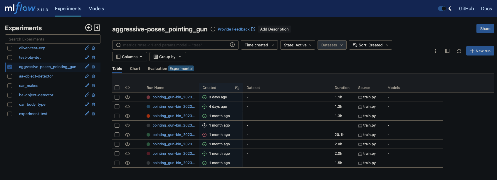

   •	Click on the name of the experiment you want to review.

3. **Select a Specific Run**:

   •	Within an experiment, you will see a list of runs. Each run represents a specific execution of a model training process.

   

   •	Click on a specific run to view more details.

   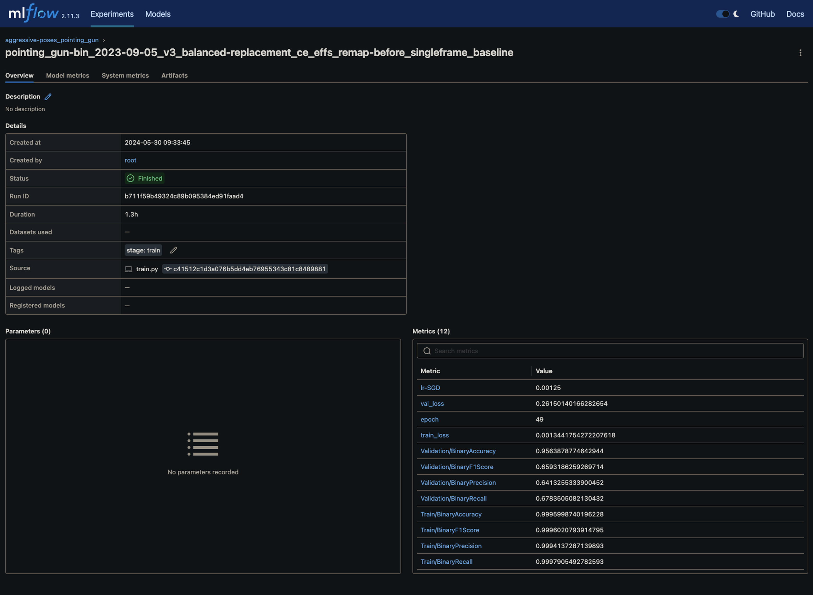

4. **Review the Metrics**:

   •	In the run detail page, navigate to the "Metrics" section.

   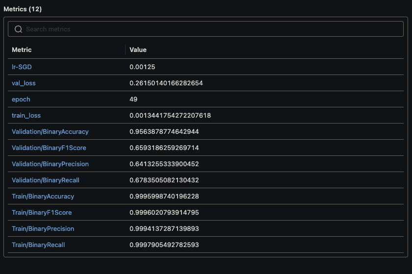

   •	Here, you will see all the metrics that were logged during the model's training session, such as loss, accuracy, precision, etc.

   •	You can click on each metric to view a detailed graph of how the metric changed over time during training.
   
   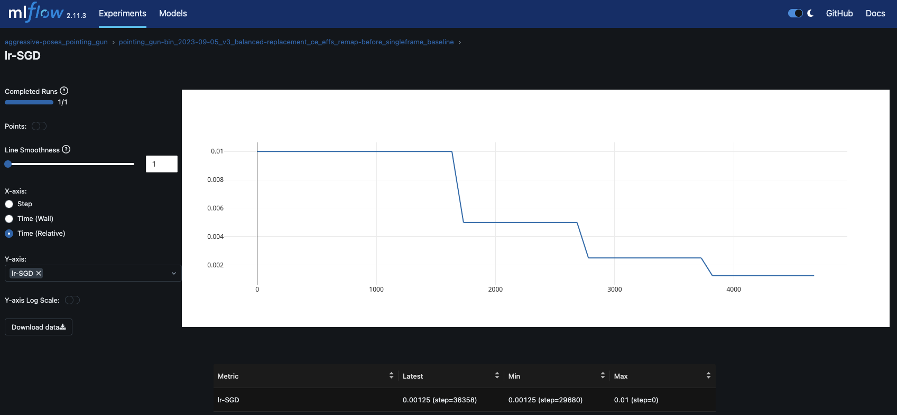

5. **Compare Runs**:

   •	To compare metrics across multiple runs, go back to the experiment page.

   •	Use the checkboxes to select multiple runs.


   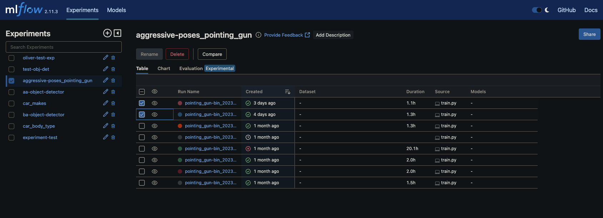


   •	Click on the "Compare" button at the top of the runs list.

   •	This will bring up a comparison page where you can see side-by-side metric comparisons and other details like parameters.

   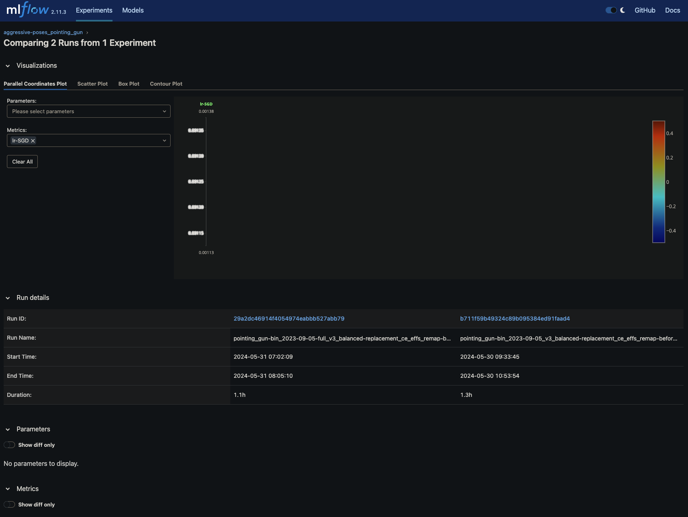

6. **Analyze Trends**:

   •	Use the visualization tools provided by MLFlow to analyze trends over time.

   •	This can help in understanding how different parameter tunings or model adjustments have impacted the performance.

By following these steps, you can effectively manage your mlflow projects, repositories, and pipelines through the mlflow Console UI.

### Accessing and using mlflow within a python script


#### Setting the MLflow Tracking URI
First, you need to install or be sure that the `mlflow` library is installed within your virtual environment or docker image ([link for installation steps](https://mlflow.org/docs/latest/getting-started/intro-quickstart/index.html)).

<div style="text-align:justify">
  The first step is to connect any Python script to the MLflow server running within the Kubernetes cluster. This is achieved by setting the MLflow tracking URI to the appropriate address. The URI for the MLflow would look like the following:
</div>

  ```
    http://mlflow-service-dev.mlops-dev.svc.cluster.local:5000
  ```

<div style="text-align:justify">
First, within your Python script, set the MLflow tracking URI to point to the MLflow tracking server deployed within your Kubernetes cluster. This is crucial for ensuring your MLflow client can communicate with the MLflow server:
</div>

```python
import mlflow

# Set the MLflow tracking URI to the MLflow service within the Kubernetes cluster
mlflow.set_tracking_uri('http://mlflow-service-dev.mlops-dev.svc.cluster.local:5000')
```

This URI directs MLflow to log all data (experiments, runs, metrics, parameters, and models) to the specified MLflow server.

#### How to Creating and Select an Experiment

An experiment in MLflow is a way to organize your runs. Before logging parameters, metrics, or models, specify the experiment under which your runs will be logged:

```python
# Set or create the experiment
experiment_name = "My First Experiment"
mlflow.set_experiment(experiment_name)
```

If the experiment does not exist, MLflow will create it. Otherwise, it will select the existing experiment to log subsequent runs.

#### Logging Parameters, Metrics, and Artifacts
<div style="text-align:justify">
With the experiment set, you can now log parameters (configurable aspects of your model), metrics (quantitative measures of performance), and artifacts (any files, including models):
</div>

#### Start a Run

A run is an individual attempt within an experiment:

```python
with mlflow.start_run():
    # Your machine learning code here
```

#### Log Parameters

Parameters are key-value pairs:

```python
mlflow.log_param("learning_rate", 0.01)
mlflow.log_param("batch_size", 32)
```

#### Log Metrics

Metrics are numerical values used to evaluate the model:

```python
mlflow.log_metric("accuracy", 0.95)
mlflow.log_metric("loss", 0.05)
```

#### Log Artifacts

Artifacts can be any file, including models:

```python
# Assuming you have a model saved as 'model.pkl'
mlflow.log_artifact("model.pkl")
```

#### Accessing Logged Data
<div style="text-align:justify">
Once you've logged parameters, metrics, and artifacts, you can access this information through the MLflow UI, which is accessible (if properly configured) at the tracking URI in a web browser. Alternatively, use the MLflow Python API to query your experiments and runs programmatically.
</div>


Below is a simple, complete example script that logs an experiment, a run, parameters, metrics, and a dummy model file:

```python
import mlflow

# Set the MLflow tracking URI
mlflow.set_tracking_uri('http://mlflow-service.mlops.svc.cluster.local:5000')

# Set the experiment
mlflow.set_experiment("Example Experiment")

with mlflow.start_run():
    # Log parameters
    mlflow.log_param("learning_rate", 0.01)
    mlflow.log_param("batch_size", 32)
    
    # Log metrics
    mlflow.log_metric("accuracy", 0.95)
    mlflow.log_metric("loss", 0.05)
    
    # Assuming a dummy model is saved as 'model.pkl' in the current directory
    mlflow.log_artifact("model.pkl")
```


#### Using PyTorch Callbacks with PyTorch Lightning

##### Overview
<div style="text-align:justify">
PyTorch Lightning abstracts the complexity of training neural networks with a high-level interface for PyTorch. It separates the research code from the engineering code, making the code base cleaner and more maintainable. Using callbacks, we can hook into the training loop at specific points to extend its functionality.
</div>

##### Defining the Components

###### LightningDataModule

A LightningDataModule encapsulates the data loading logic, including preprocessing, augmentation, and sampling. It defines four key methods:

- `prepare_data`: Used for downloading data.
- `setup`: Used to process and split the data into train, validation, and test datasets.
- `train_dataloader`: DataLoader for the training set.
- `val_dataloader`: DataLoader for the validation set.

Example:

```python
from pytorch_lightning import LightningDataModule

class MyDataModule(LightningDataModule):
    def __init__(self, data_dir: str, batch_size: int):
        super().__init__()
        self.data_dir = data_dir
        self.batch_size = batch_size
    
    # Implement the four key methods here
```

###### LightningModule

A LightningModule represents the core of the model and is where the model definition, forward pass, and training steps are defined.

Example:

```python
from pytorch_lightning import LightningModule

class MyModel(LightningModule):
    def __init__(self):
        super().__init__()
        self.model = MyCustomModel()

    def forward(self, x):
        return self.model(x)
    
    def training_step(self, batch, batch_idx):
        # Training logic here
```

###### Trainer

The Trainer orchestrates the training process by leveraging the data module and the model.

Example:

```python
from pytorch_lightning import Trainer

trainer = Trainer(
    max_epochs=10,
    gpus=1,
    logger=my_logger,
    callbacks=[my_callback]
)
trainer.fit(my_model, datamodule=my_datamodule)
```

###### Callbacks
<div style="text-align:justify">
Callbacks in PyTorch Lightning allow you to hook into the training loop and execute logic at specific stages. They are powerful tools to inject behavior into the training loop without changing the actual training logic code.
</div>

Example of a simple callback:

```python
from pytorch_lightning.callbacks import Callback

class MyCallback(Callback):
    def on_train_start(self, trainer, pl_module):
        print("Training is starting!")

    def on_train_epoch_end(self, trainer, pl_module, outputs):
        print("A training epoch has finished!")
```

##### Configuration with Hydra
<div style="text-align:justify">
Hydra is used for managing complex configurations, allowing you to define a dictionary-like object in .yaml files and access it as an object in your code.
</div>

Example of `yaml` configuration:

```yaml
model:
  type: MyModel
dataloader:
  path: /path/to/data
  batch_size: 32
```

And to use this configuration in your script:

```python
from omegaconf import OmegaConf

@hydra.main(config_path="config", config_name="default")
def main(cfg: OmegaConf):
    model = instantiate_model(cfg.model)
    datamodule = instantiate_datamodule(cfg.dataloader)
    # Instantiate trainer and start training
```

###### Logging with MLflow

With PyTorch Lightning, you can directly log metrics, parameters, and models to MLflow within your LightningModule:

```python
from pytorch_lightning.loggers import MLFlowLogger

mlflow_logger = MLFlowLogger(
    experiment_name="experiment_name",
    tracking_uri="http://mlflow-service.mlops.svc.cluster.local:5000"
)
trainer = Trainer(logger=mlflow_logger)
```

##### Putting It All Together

To use PyTorch callbacks in a generalized but detailed manner, you need to:

1. Define your data handling in a LightningDataModule.
2. Implement your model in a LightningModule.
3. Set up your training with a Trainer and configure it with your desired hyperparameters, logger, and callbacks.
4. Optionally, manage configurations using Hydra for easy experimentation.
5. Utilize loggers like MLflow to track your experiments.

<div style="text-align:justify">
This framework provides a robust structure to create reproducible and maintainable ML code, with the flexibility to inject custom behavior and logging throughout the training process.
</div>


#### Configuration with Hydra for Machine Learning Workflows
<div style="text-align:justify">
Hydra is a powerful and flexible framework for configuring complex applications. It's particularly well-suited for machine learning projects where numerous experiments with different sets of hyperparameters, data sources, and processing steps are common. By leveraging Hydra, you can manage these configurations with ease and repeatability.
</div>


##### Overview of Hydra
<div style="text-align:justify">
Hydra allows you to create a hierarchical configuration by composing it from individual configuration files. These files are typically written in YAML, a straightforward, human-readable data serialization standard. In the context of machine learning, Hydra can manage a wide variety of configurations needed for training, including but not limited to:
</div>

- Model architectures
- Data loading and processing pipelines
- Training procedures
- Hyperparameters
- Logging and monitoring setups

##### Advantages of Using Hydra

- **Simplification**: It abstracts away the boilerplate code needed for argument parsing.
- **Flexibility**: Easy to make changes without altering the code; just update the configuration files.
- **Modularity**: Configurations can be structured in a modular fashion, which promotes reuse and sharing of configuration components.

##### Using Hydra in Your Machine Learning Pipeline
<div style="text-align:justify">
Here's a general outline of how you might use Hydra to configure different aspects of a machine learning pipeline:
</div>

##### Define Configuration Templates
<div style="text-align:justify">
Hydra works with templates that define the structure of your configurations. Each aspect of your pipeline, like the model or data loader, can have its template, detailing the parameters and default values:
</div>

```yaml
# model_config.yaml
model:
  type: 'resnet'
  layers: 50
  output_classes: 10
  pretrained: true

# dataloader_config.yaml
dataloader:
  batch_size: 32
  shuffle: true
  num_workers: 4
```

##### Compose Configurations
<div style="text-align:justify">
You can then compose a master configuration file that includes these templates and provides overrides or additional parameters specific to an experiment:
</div>

```yaml
# master_config.yaml
defaults:
  - model: resnet50
  - dataloader: imagenet
```

##### Parameterize Experiments
<div style="text-align:justify">
With Hydra, you can parameterize your experiments by simply passing different values for the configuration files or individual parameters through the command line or by modifying the configuration files directly:
</div>

```bash
$ python train.py model=vgg19 dataloader=custom_dataset
```

This command will override the `model` and `dataloader` configurations with `vgg19` and `custom_dataset` respectively.

##### Instantiate Configurations in Code

Within your Python code, Hydra will instantiate your configurations and make them available as objects:

```python
@hydra.main(config_path="conf", config_name="config")
def main(cfg):
    model = build_model(cfg.model)
    dataloader = build_dataloader(cfg.dataloader)
    # ... rest of the training pipeline
```

##### Flexibility in Logging and Experiment Tracking
<div style="text-align:justify">
You can specify logging and experiment tracking configurations such as TensorBoard, MLFlow, or Weights & Biases in your Hydra configurations, enabling you to switch between different loggers or even use multiple loggers simultaneously:
</div>

```yaml
# logger_config.yaml
logger:
  - tensorboard: true
  - mlflow: true
```

##### Handle Training Process
<div style="text-align:justify">
Lastly, define the trainer parameters like the number of epochs, whether to use GPUs, and the number of GPUs, all within a configuration file that can be easily adjusted as needed:
</div>

```yaml
# trainer_config.yaml
trainer:
  epochs: 100
  gpus: 2
  distributed_backend: 'ddp'
```

<div style="text-align:justify">
By leveraging Hydra in your machine learning projects, you gain the ability to manage complex configurations with ease. This approach not only reduces errors but also makes your experiments reproducible and your workflow much more manageable. You can find more about Hydra and its capabilities in the [official Hydra template](https://hydra.cc/docs/intro).
</div>


## Maintainance

### Cronjobs for backup

<div style="text-align:justify">
Our current focus is on establishing robust and reliable data backup solutions for our MLflow and mlflow services through the implementation of Kubernetes (K8s) cron jobs. This initiative is essential for safeguarding our valuable data sets and machine learning artifacts.
<div>

### Background
<div style="text-align:justify">
Several months back, we had successfully deployed a K8s cronjob dedicated to backing up MLflow data. Unfortunately, this cronjob was inadvertently removed during the node update process in December 2023. Recognizing the importance of maintaining continuous data protection, a Cronjob template has beed developed within the mlop repo.</div> 

([link](https://pending-cronjobs-to-migrate.data.into-pachyderm))

### Backup Strategy
<div style="text-align:justify">
The backup process was scheduled to occur weekly, specifically every Saturday at 5:00 AM. This timing was chosen to minimize the potential disruption to our services, as it is a period of relatively low activity. The backup operation will be performed using rsync, a utility for efficiently transferring and synchronizing files across systems. It will capture any modifications made to the contents of the following directories within the pending/folder/path NFS:

`/pending/folder/path/aidrive/mlflow`: This directory houses the MLflow data, including all registered models, parameters, metrics, and artifacts associated with our machine learning projects.
`/pending/folder/path/mlflow_data`: This directory contains mlflow data, holding versioned data repositories critical for our data versioning and lineage tracking needs.
By using rsync, we ensure that only the changes since the last backup are transferred, making the process efficient and reducing the load on our network resources.

</div>

## Looking Ahead
<div style="text-align:justify">
The restoration and addition of these cron jobs represent a commitment to data integrity and operational resilience. By automating the backup process, we not only protect against data loss but also set a foundation for future scalability as the volume of our data grows. As we move forward, we will continue to monitor, evaluate, and enhance our backup processes to meet the evolving needs of our ML workflows and data management practices.
</div>


## Architecture Vision and services used


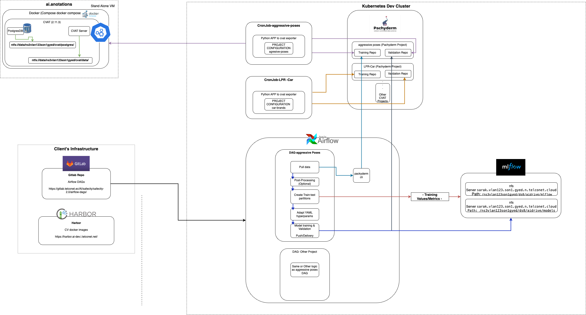


### MLFlow in MLOps Architecture
MLFlow serves as the central component within the MLOps architecture, orchestrating the model training and evaluation process. It is seamlessly integrated into the MLOps workflow, enabling efficient tracking, experimentation, and management of machine learning models.

#### MLFlow Integration and Functionality
•	Experiment Tracking: MLFlow logs detailed information about each training session, including parameters, code versions, metrics, and output files, to facilitate comprehensive tracking and comparison of different runs.
•	Model Management: MLFlow's Model Registry is used for versioning and managing machine learning models. It allows for the staging and production of models, ensuring controlled and traceable deployments.
•	Project Packaging: MLFlow Projects package the code, data, and environment needed to reproduce runs, streamlining the hand-off from data scientists to production.
•	Model Serving: Through its built-in functionalities, MLFlow can package models as Docker containers for easy deployment, serving as a scalable and flexible model serving solution.

#### Interactions with Other Services
•	DeepStream Pipeline and Event Detection: Post-training, models may be deployed into a DeepStream pipeline for real-time video analytics and event detection. The outcomes feed into the system, potentially influencing subsequent training cycles within MLFlow.


# Conclusion
<div style="text-align:justify">
This documentation outlines the foundational steps for integrating MLflow into your machine learning workflows within a Kubernetes environment. By following these guidelines, you can leverage MLflow's capabilities for experiment tracking, parameter and metric logging, and model management to streamline and enhance your machine learning projects.
</div>

