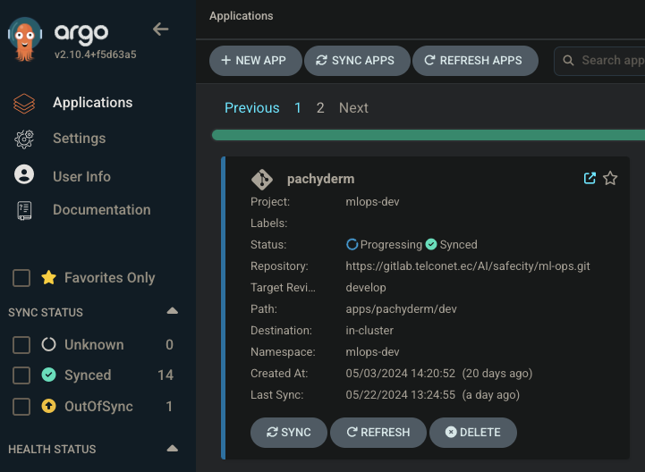

<br />
<br />

# Pachyderm Documentation for DevOps

This documentation provides a comprehensive guide on how to utilize Pachyderm for managing the machine learning lifecycle, including experimentation, model tracking, and deployment. The focus here is on executing an Pachyderm-enabled Python script within a Kubernetes (K8s) pod. The Pachyderm server is accessible within the pods through a dedicated K8s service named `pachyderm-proxy` located in the `mlops-dev` namespace.

## Specific Objective: Utilizing Pachyderm for Data Versioning in the Safecity Project

The primary objective of using Pachyderm  is to establish a robust system for storing videos and ensuring efficient data versioning. This system is designed to manage the vast amounts of video data generated by the Safecity surveillance system, leveraging on-premise infrastructure to comply with project restrictions that prohibit cloud deployment. By utilizing Pachyderm, we aim to provide a reliable and scalable solution for video storage and data versioning, enhancing their AI-powered video surveillance capabilities.

### Project Restrictions and Infrastructure

Due to the project's restrictions, we are not deploying any part of the system in the cloud. Instead, the solution utilizes their on-premise computing resources, including the NVIDIA RTX/GTX cards.


### Role of Pachyderm

Pachyderm plays a crucial role in the Safecity project by offering a robust solution for data versioning. Data versioning is a critical MLOps practice that allows Machine Learning Engineers to debug, investigate, and recreate models from any point in time. This capability is vital for maintaining the integrity and reliability of the machine learning models used in the Safecity project.

#### Key Benefits of Using Pachyderm:

1. **Efficient Data Management**: Pachyderm allows for the versioning of video data, ensuring that every change is tracked and recorded. This is essential for debugging and improving machine learning models.

2. **Scalability**: With the support of NVIDIA GPUs, Pachyderm can handle large-scale data analytics and storage requirements, making it ideal for the high data throughput of the Safecity project.

3. **Accessibility**: Pachyderm integrates seamlessly with the model training pipeline, allowing easy access to versioned data for training and evaluation purposes.

4. **Enhanced Security**: By keeping all data on-premise, we ensures compliance with local data protection regulations and enhances the security of the surveillance data.

### Implementation Plan

The implementation of Pachyderm in the project includes the following steps:

1. **Setup and Configuration**: Install and configure Pachyderm on the on-premise infrastructure, ensuring integration with the existing NVIDIA GPUs.

2. **Data Ingestion and Versioning**: Implement data ingestion workflows to automatically version video data from the surveillance system, maintaining a comprehensive history of all data changes.

3. **Integration with Machine Learning Pipelines**: Integrate Pachyderm with the machine learning training pipelines to enable efficient access to versioned data for model training and evaluation.

4. **Monitoring and Maintenance**: Establish monitoring and maintenance protocols to ensure the continuous operation and performance of the Pachyderm system.


## Table of Contents
<style scoped>
table {
  font-size: 7px;
}
</style>

| Syntax                                                                                             | Description                                                                                 |
| :------------------------------------------------------------------------------------------------- | :------------------------------------------------------------------------------------------ |
| [Prerequisites](#prerequisites)                                                                    | What is needed to use Pachyderm in a Kubernetes environment                                 |
| [Installation](#installation)                                                                      | Methods for installing Pachyderm, both manually and using ArgoCD                            |
| [Use](#use)                                                                                        | How to use Pachyderm after installation                                                     |
| [Maintainance](#maintainance)                                                                      | Backup strategies and maintenance practices for Pachyderm                                   |
| [Common errors in Pachyderm and how to Debug them](#Common-errors-in-pachyderm-and-how-to-debug-them) | Most common errors found while working with pachyderm                                    |
| [Architecture vision and services used](#architecture-vision-and-services-used)                    | General overview of the infrastructure                                                      |
| [Monitoring and Logging](#monitoring-and-logging)                                                  | Setting up monitoring and logging for Pachyderm                                             |

<div style="page-break-after: always"></div>


## Prerequisites


Before proceeding, ensure you have performed the following steps:

- Ensure you have access to the server/cluster (access to master node(s))
- Ensure kubectl is installed in the master node(s) [link](https://kubernetes.io/docs/tasks/tools/)
- Ensure Helm is installed in the master node(s)
- Ensure you have StorageClasses available or already configured inside of Kubernetes cluster


## Installation

Installation is being divided into two methods: manual and automatic (using ArgoCD). The manual method involves directly configuring and deploying Pachyderm using Helm commands. On the other hand, the automatic method leverages ArgoCD, a declarative GitOps continuous delivery tool, to manage the deployment of Pachyderm. This approach streamlines the installation process by automating the deployment and management of the necessary resources through Git repositories, ensuring consistency and ease of updates. Currently, the deployment of Pachyderm is being handled via ArgoCD, which facilitates seamless and efficient management of the deployment, providing an automated and reliable way to maintain the Pachyderm infrastructure.


### Manual Installation

#### Installing through Helm chart

To install Pachyderm on-premises, follow these detailed steps to ensure a successful deployment using Helm:

1. **Add the Pachyderm Helm Repository**:
   Begin by adding the Pachyderm Helm repository and updating it to get the latest charts.

   ```sh
   helm repo add pachyderm https://helm.pachyderm.com
   helm repo update
   ```

2. **Configure Helm Values**:
    Configure the Helm values for various components including `etcd`, `PostgreSQL`, `Ingress`, and `Loki-stack`. Below is an example configuration used for Dev environment:

    ```yaml
      etcd:
      storageClass: "nfs-client"
      storageSize: "" # amount of storage volume you would like to assign, e.g., 10Gi

    postgresql:
      volumePermissions:
        enabled: true
        image:
          registry: your_private_registry
          repository: mlops/bitnami/bitnami-shell
          tag: 10-debian-10-r125
      persistence:
        enabled: true 
        existingClaim: "postgres-pvc"
        storageClass: "sc-pachyderm"
        size: "" # amount of storage volume you would like to assign, e.g., 10Gi

    ingress:
      enabled: true
      host: "your_host"

    loki-stack:
      loki:
        persistence:
          enabled: true
          existingClaim: "loki-pvc"
          storageClassName: "sc-pachyderm"
        securityContext:
          fsGroup: 1000
          runAsGroup: 1000
          runAsNonRoot: true
          runAsUser: 1000

    ```


3. **Deploy Pachyderm**:
    Use Helm to install Pachyderm with the configured settings. Ensure you set the deployment target to local, enable the proxy, and specify the appropriate service type and host.

    ```sh

    helm install pachyderm ./pachyderm \
      --set deployTarget=LOCAL \
      --set proxy.enabled=true \
      --set proxy.service.type=ClusterIP \
      --set proxy.host=localhost \
      --namespace mlops-dev
    ```

4. **Verify installation**:
    In another terminal, run the following command to check the status of your pods:

    ```sh
    kubectl get pods
    ```

    you should be able to see a similar output like this:

    ```
    NAME                                           READY   STATUS      RESTARTS   AGE
    pod/console-5b67678df6-s4d8c                   1/1     Running     0          2m8s
    pod/etcd-0                                     1/1     Running     0          2m8s
    pod/pachd-c5848b5c7-zwb8p                      1/1     Running     0          2m8s
    pod/pg-bouncer-7b855cb797-jqqpx                1/1     Running     0          2m8s
    pod/postgres-0                                 1/1     Running     0          2m8s

    ```

### Deploying Pachyderm through ArgoCD

#### Overview

Pachyderm is deployed in our MLOps pipeline through ArgoCD, which automates the synchronization and management of Kubernetes resources from a git repository. This documentation covers the process of deploying Pachyderm using ArgoCD.

#### Repository Structure

The current structure of the [repository](https://github.com/oliver2401/mlops/tree/main) is as follows:


- **charts:** Contains Helm charts for the services.
- **dependencies:** Stores any dependent services like PostgreSQL.
- **scripts:** Location for utility scripts.
- **templates:** Helm templates for Kubernetes objects.
- **values.yaml:** The main configuration file where you can define values for different environments (dev, prod, etc.).

The repository is designed to accommodate additional folders for different environments (e.g., **prod, QA**). When you commit changes to the master branch or any other tracked branch, ArgoCD detects the changes and automatically deploys them to the specified environment.

#### ArgoCD Template and Values

The ArgoCD application set template and values are defined in this [this repo](https://github.com/oliver2401/Argo-Pipeline/tree/main):


This repository contains the YAML files for the AppProject and ApplicationSet resources, which define the deployment configurations for ArgoCD.

#### Deploying Pachyderm
##### AppProject

The AppProject defines the boundaries for what resources and destinations are permissible for the Application.

```yaml

apiVersion: argoproj.io/v1alpha1
kind: AppProject
metadata:  
  name: mlops-{{ .Values.environment }}
  namespace: argocd 
spec:
  clusterResourceWhitelist:
  - group: '*'
    kind: '*'
  destinations:
  - namespace: "mlops-{{ .Values.environment }}"
    server: '*'
  sourceRepos:
  - '*' 

```

This resource scopes the deployment to a particular environment, specified by {{ .Values.env }}.

##### ApplicationSet

The **ApplicationSet** defines a template that generates Applications from a set of parameters.

```yaml

apiVersion: argoproj.io/v1alpha1
kind: ApplicationSet
metadata:
  name: "mlops-{{ .Values.environment }}"
  namespace: argocd
spec: 
  generators:
  - git:
      repoURL: https://github.com/oliver2401/mlops.git
      revision: main
      files:
        - path: "apps/*/{{ .Values.environment }}/values.yaml"
  syncPolicy:
    preserveResourcesOnDeletion: true
  template:
    metadata:
      name: '{{ "{{path[1]}}" }}'
    spec:
      project: "mlops-{{ .Values.environment }}"
      source:
        repoURL: https://github.com/oliver2401/mlops.git
        targetRevision: main
        path: '{{ "{{path}}" }}'
        helm:
          valueFiles:
          - ../values.default.yaml
          - values.yaml
          parameters:
          - name: "environment"
            value: {{ .Values.environment }}
          - name: "dags.gitSync.repo"
            value: {{ .Values.mlops.airflow.dags.gitSync.repo }}
          - name: "dags.gitSync.branch"
            value: {{ .Values.mlops.airflow.dags.gitSync.branch }}
      destination:
        name: "in-cluster"
        namespace: "mlops-{{ .Values.environment }}"
      syncPolicy:
        syncOptions:
            - CreateNamespace=true
        automated:
          prune: true
```

The ApplicationSet uses a Git generator to monitor a repository and create Applications based on changes to the specified files.

##### Modifying Values for New Environments

To deploy Pachyderm in a new environment, you can simply modify the values in the `values.yaml` file corresponding to that environment. This allows for a flexible and scalable deployment process.

##### Verify Deployment using ArgoCD GUI

Once you have made changes to the Pachyderm service and its `values.yaml` file, you will need to ensure that these changes are correctly applied and that the service is functioning as expected. To do this, navigate to the ArgoCD interface at argocd UI. 

In the ArgoCD dashboard, search for the `pachyderm` application as shown in the following image: 



Verify that the application is correctly synced and has a healthy status. This step is crucial to confirm that the updates have been successfully deployed and that the Pachyderm service is operating without issues. Monitoring the sync status and health in ArgoCD helps maintain the stability and reliability of your Pachyderm deployment. An example of the healthy status of the app might look like the following:


#### Accessing Pachyderm from Outside the Cluster

To access Pachyderm from outside the Kubernetes cluster (e.g., via a web browser), you need to enable and configure a Kubernetes ingress. This can be done by modifying the `values.yaml` file with the following parameters:

```yaml
ingress:
  enabled: true
  host: "your_host"
```

The current ingress was deployed using the DNS your_host.
As a side note, to access Pachyderm, you will need to add this DNS entry to the /etc/hosts file on your machine. The entry should be:

```
your_ip your_host
```

Additionally, ensure you are connected to the VPN to access Pachyderm.


## Use

Pachyderm can be accessed via two URLs depending on your network location. For external access outside of the Kubernetes cluster, you can use the URL [http://your_host](http://your_host). If you are inside the Kubernetes cluster, Pachyderm can be accessed via the internal Kubernetes service URL [http://pachyderm-proxy.mlops-dev.svc.cluster.local:80](http://pachyderm-proxy.mlops-dev.svc.cluster.local:80). These URLs provide flexibility for accessing Pachyderm both externally and internally within the cluster.

### Accessing and using Pachyderm using the GUI

If you have installed the Console with your Pachyderm cluster, you can access it and view your pipelines, repositories, and other Pachyderm objects in the UI. Follow these steps to access the Pachyderm Console:

1. **Open Pachyderm Console:**
   Go to [your_host](http://your_host) in a web browser.

2. **Login and Home Dashboard:**
   Upon login, the home dashboard will show all your available repositories and pipelines.

   

3. **Projects Dashboard:**
   - In the "Projects" dashboard, you can select or create projects.
   - If you want to create a new project, click on "Create Project" and input a project name and description.

   
   

4. **Navigate into Your Project:**
   Once you have created a project, navigate into your project.

5. **Creating a Repository:**
   - Select `Create` and then `Input Repository`.
   - Input a repo name and description.
   - Select `Create`.

   
   

6. **Uploading Content:**
   - To upload content, you need to specify the repo and branch you’d like to upload to (e.g., a master or staging branch).
   - In the Console, it automatically defaults to `repo@master`. For PachCTL, you’ll need to use the `repo@master:filename.ext` pattern.

7. **Default Pipeline Trigger:**
   By default, your pipeline will trigger any time new data is uploaded to the master branch unless otherwise specified in the pipeline spec at `input.pfs.branch` or through a branch trigger. For this tutorial, we’re going to stick with the default master branch.

8. **Uploading Files:**
   - Select `Upload Files`.
   - Choose your images, videos, or directory.
   - Select `Upload`.
   - Select `Done`.

   
   

By following these steps, you can effectively manage your Pachyderm projects, repositories, and pipelines through the Pachyderm Console UI.


### Accessing and using Pachyderm using the CLI

You can also interact your Pachyderm cluster using the PachCTL CLI. PachCTL is great for users already experienced with using a CLI.
In order to interact with Pachyderm via CLI you must first install [`pachctl`](https://docs.pachyderm.com/products/mldm/latest/set-up/pachctl/).

#### Connecting pachyderm client to the Pachyderm remote service
<div style="text-align:justify">
  Once you have installed `pachctl` now is time to connect to the Pachyderm service running within the Kubernetes cluster. This is achieved by setting `pachctl` to the appropriate URI. An example for connecting `pachctl` is the following:
</div>

  
  ```sh
    pachctl connect http://pachyderm-proxy.mlops-dev.svc.cluster.local:80
  ```
where `pachyderm-proxy` is the name of the K8s service, `mlops-dev` is the namespace where the service is deployed and `80` is the port exposed by the service in order to access Pachyderm.
This URI directs you to fetch all the information (data, repos, branches, commits, and projects) from the Pachyderm server.

You can check your Pachyderm version and connection to pachd at any time with the following command:

```sh
pachctl version
```
and you should get a similar response like this one:

``` sh
COMPONENT           VERSION  

pachctl             2.10.1  
pachd               2.10.1  
```

Once you have connected via `pachctl` then you will have to update your context for your specific Pachyderm project like the following example:

```sh

pachctl config update context --project "YOUR_PROJECT_NAME"

```


<div style="text-align:justify">

</div>


Now you can go through the basics of using Pachyderm for project creation, repository setup, and content uploading.

1. **Creating a Project:**
Start by creating a new project and setting it as your active context to simplify command usage:

```bash
pachctl create project my-new-preoject
pachctl config update context --project my-new-preoject
pachctl list projects
```

## 2. Create an Input Repository
Create a repository to store your raw videos and images:

```bash
pachctl create repo my-new-preoject
pachctl list repos
```

## 3. Upload Content
Upload files to your repository specifying the branch and file path. Here are examples using the master branch:

```bash
pachctl put file my-new-preoject@master:liberty.png -f https://file/from/url/liberty.jpg
pachctl put file my-new-preoject@master:cat-sleeping.MOV -f path/to/local/file
pachctl put file -R my-new-preoject@A-New-Branch -f path/to/local/directory
```

To view the contents of your repository:

```bash
pachctl list files raw_videos_and_images@master
```

for further information about all the available commands you can visit [the official documentation](https://docs.pachyderm.com/products/mldm/latest/run-commands/).

## Maintainance

Ensuring regular backups of your Pachyderm cluster is essential for maintaining data integrity and availability. This documentation provides guidelines for performing and verifying backups, along with references to detailed official documentation.

### Backup Schedule and Verification
To minimize the risk of data loss and ensure quick recovery in case of a failure, it is recommended to adhere to the following backup schedule:
- **Frequency**: Perform backups every two months.
- **Verification**: After each backup, verify the backup to ensure that all data is correctly captured and the backup process has completed successfully. This verification process is critical to confirm the integrity and usability of the backup.

### Backup Procedure
1. **Plan Your Backup**: Determine the storage location and capacity required for your backups. Ensure that the destination has enough space to accommodate the backup data.
2. **Initiate Backup**: Follow the steps outlined in the official Pachyderm documentation to start the backup process. Ensure that all critical data, including repositories, pipelines, and metadata, are included in the backup.
3. **Monitor Backup**: During the backup process, monitor the operation to identify any issues or interruptions. Ensure that the backup completes without errors.
4. **Verify Backup**: After the backup process completes, perform a verification to check the integrity and completeness of the backup. This can include checking file sizes, running integrity checks, and ensuring that the backup data can be restored successfully.

### Restoration Procedure
In the event of data loss or corruption, restoring your Pachyderm cluster from a backup is essential. Follow these steps to restore your data:
1. **Identify the Backup**: Choose the most recent verified backup for restoration.
2. **Prepare the Environment**: Ensure that the restoration environment is ready, including sufficient storage space and any required configurations.
3. **Initiate Restoration**: Follow the restoration steps outlined in the official Pachyderm documentation to restore your data. Ensure that all data and configurations are correctly restored.
4. **Verify Restoration**: After restoration, verify that all data is correctly restored and the system is operational. Perform tests to ensure that pipelines and repositories are functioning as expected.

### Additional Resources
For more detailed instructions on performing backups and restorations, refer to the official Pachyderm documentation:
- [Backup Pachyderm Cluster](https://docs.pachyderm.com/products/mldm/latest/manage/backup-restore/cluster/)
- [Restore Pachyderm Cluster](https://docs.pachyderm.com/products/mldm/latest/manage/backup-restore/restore/)

These resources provide comprehensive guidance on securely backing up and restoring your Pachyderm data, ensuring you are well-prepared for any data recovery scenarios.


**Future Developments**

As we scale and introduce more environments, this process will become increasingly automated, allowing for rapid and consistent deployment across different clusters and environments.

Note: The above process is specific to our current deployment strategy and should be tailored to the requirements of the individual or organization. The attached screenshots provide a visual reference for the repository's structure, and the values within values.yaml should be adjusted according to the needs of the deployment.

## Common errors in Pachyderm and how to Debug them

Depending on the issue that you might experience, we recommend visit the official [documentation](https://docs.pachyderm.com/latest/debug/common-issues/) to take a deeper look at the issue you are facing.

## Architecture vision and services used


## Monitoring and Logging

Pachyderm includes support for Prometheus metrics, which can be scraped for monitoring. Currently there are a couple of metrics being displayed in
Grafana


### Example values.yaml for Monitoring
```yaml

pachd:
  service:
    prometheusPort: 30656

```

Prometheus can scrape metrics from the Pachyderm service at the specified port. Ensure Prometheus is configured to scrape this endpoint.